# 🎨 Frontend UX & Implementation Plan

> **Scope**: This document defines the **frontend UX**, **design system**, and **implementation architecture** for Vikram's personal portfolio site. It assumes the backend emits the normalized static contract described in `notion_backend.plan.md`.

---

## 📋 Table of Contents

1. [Goals & Non-Goals](#-goals--non-goals)
2. [Tech Stack & Framework](#-tech-stack--framework)
3. [Liquid Glass Implementation Guide](#-liquid-glass-implementation-guide)
4. [UX Overview](#-ux-overview)
5. [Information Architecture](#-information-architecture)
6. [Deep-Linking & Routing](#-deep-linking--routing)
7. [Visual Design System](#-visual-design-system)
8. [Motion & Interactions](#-motion--interactions)
9. [Rendering Model](#-rendering-model)
10. [Component Architecture](#-component-architecture)
11. [Section-by-Section Breakdown](#-section-by-section-breakdown)
12. [Data Consumption Contract](#-data-consumption-contract)
13. [Performance Strategy](#-performance-strategy)
14. [Accessibility & Responsiveness](#-accessibility--responsiveness)
15. [Implementation Phases](#-implementation-phases)
16. [Risks & Mitigations](#-risks--mitigations)

---

## 🎯 Goals & Non-Goals

### ✅ Goals

| Goal | Why It Matters |
|------|----------------|
| **App-like single-page experience** | Scroll-based exploration with panes/modals for detail feels modern and fluid |
| **Deep-linkable entities** | Shareable URLs for involvements, projects, orgs (recruiters can send specific links) |
| **High-fidelity liquid glass everywhere** | Apple-esque refraction/highlights that respond to pointer like a moving light source |
| **Performance-first** | Fast first paint is a hiring signal; progressive enhancement for effects |
| **Deterministic, reusable UI** | Data-driven templates; no bespoke per-item layouts |
| **Responsive + accessible** | Works beautifully on desktop and mobile; keyboard and reduced motion supported |

### 🚫 Non-Goals (MVP)

| Non-Goal | Notes |
|----------|-------|
| Live AI chat backend | Hero chat is UI shell with friendly "still training" response |
| Runtime Notion calls | No Notion token in the browser; all content is static |
| CMS admin interface | Notion *is* the CMS |

---

## 🛠 Tech Stack & Framework

### Why Astro 5 + React Islands?

| Requirement | Why Astro Fits |
|-------------|----------------|
| **Fast first paint** | Ships zero JS by default; static HTML/CSS loads instantly |
| **Static content from Notion** | Built for content sites; excellent build-time data fetching |
| **Selective interactivity** | "Islands" architecture hydrates only what needs JS |
| **View Transitions** | Built-in support for smooth page/section transitions |
| **React ecosystem** | Use React for complex islands while keeping most content static |

### The Islands Architecture

Astro renders **everything as static HTML** by default. Interactive components ("islands") are explicitly opted-in with client directives.

```
┌─────────────────────────────────────────────────────────────┐
│  STATIC (Astro)                         Zero JS by default  │
│  ┌─────────────┐  ┌─────────────┐  ┌──────────────┐        │
│  │Layout.astro │  │ About.astro │  │Timeline.astro│        │
│  └─────────────┘  └─────────────┘  └──────────────┘        │
│                                                             │
│  INTERACTIVE (React Islands)            Hydrated selectively│
│  ┌─────────────┐  ┌─────────────┐  ┌──────────────┐        │
│  │ GlassEngine │  │PaneController│ │   ChatPill   │        │
│  │    .tsx     │  │    .tsx     │  │     .tsx     │        │
│  └─────────────┘  └─────────────┘  └──────────────┘        │
└─────────────────────────────────────────────────────────────┘
```

### When to Use What

| Use Astro (`.astro`) | Use React Island (`.tsx`) |
|----------------------|---------------------------|
| Page layouts | WebGL glass engine |
| Static sections (About, Timeline structure) | Pane controller (dialog state + URL sync) |
| Content rendering from Notion JSON | Chat pill + expansion animation |
| Navigation shell (static parts) | Custom cursor effects |
| SEO meta tags | Skill popovers (Radix-based) |
| Any content that doesn't need JS | Any component with state, effects, or handlers |

### Client Directives Reference

| Directive | When It Hydrates | Best For |
|-----------|------------------|----------|
| `client:load` | Immediately on page load | Critical UI (pane controller, nav interactions) |
| `client:visible` | When scrolled into viewport | Below-fold islands (skill tree, timeline interactions) |
| `client:idle` | After page is idle | Non-critical enhancements (cursor effects) |
| `client:only="react"` | Client-only, never SSR'd | WebGL canvas (can't server-render) |

### Example: Mixing Static + Interactive

```astro
---
// src/pages/index.astro
import Layout from '../layouts/Layout.astro';
import HeroSection from '../components/sections/Hero.astro';
import TimelineSection from '../components/sections/Timeline.astro';
import GlassEngine from '../components/glass/GlassEngine.tsx';
import PaneController from '../components/panes/PaneController.tsx';
import CustomCursor from '../components/effects/CustomCursor.tsx';
---

<Layout>
  <!-- Static: renders as pure HTML, no JS -->
  <HeroSection />
  <TimelineSection />
  
  <!-- Islands: hydrate with specific strategies -->
  <GlassEngine client:only="react" />
  <PaneController client:load initialPane={Astro.props.initialPane} />
  <CustomCursor client:idle />
</Layout>
```

### Project File Structure

```
src/
├── components/
│   ├── sections/          # .astro - Static section shells
│   │   ├── Hero.astro
│   │   ├── Timeline.astro
│   │   └── Portfolio.astro
│   ├── glass/             # .tsx - React islands for WebGL
│   │   ├── GlassEngine.tsx
│   │   ├── GlassProvider.tsx
│   │   └── shaders/
│   ├── panes/             # .tsx - React islands for overlays
│   │   ├── PaneController.tsx
│   │   ├── InvolvementPane.tsx
│   │   └── ProjectPane.tsx
│   ├── ui/                # .tsx - Shared React components
│   │   ├── GlassCard.tsx
│   │   └── Badge.tsx
│   └── effects/           # .tsx - Optional enhancements
│       └── CustomCursor.tsx
├── layouts/
│   └── Layout.astro       # Base HTML shell
├── pages/
│   ├── index.astro        # Homepage
│   ├── involvements/
│   │   └── [slug].astro   # Deep-link entry routes
│   └── projects/
│       └── [slug].astro
└── lib/
    ├── notion.ts          # Content loading utilities
    └── types.ts           # Shared TypeScript types
```

---

## 🔮 Liquid Glass Implementation Guide

We're using [`liquid-glass-studio`](https://github.com/iyinchao/liquid-glass-studio) as our **reference implementation** for the WebGL liquid glass effect. This section explains how to leverage it.

### What liquid-glass-studio Provides

| Feature | Description |
|---------|-------------|
| **WebGL2 renderer** | High-performance canvas-based rendering |
| **GLSL shaders** | Refraction, dispersion, Fresnel, blur, glare effects |
| **SDF shapes** | Superellipse/blob shapes via signed distance functions |
| **Blob merging** | Smooth "liquid" transitions between shapes |
| **Spring animations** | Physics-based motion for organic feel |
| **Leva controls** | Debug UI for tweaking parameters (dev only) |

### Integration Strategy

We are **not using liquid-glass-studio as a dependency**. Instead, we're:

1. **Studying the implementation** to understand the shader techniques
2. **Extracting and adapting** the core shader code for our needs
3. **Building a simplified version** optimized for our specific use case

#### Why Not Use It Directly?

| Reason | Explanation |
|--------|-------------|
| **Bundle size** | Full library includes features we don't need (video backgrounds, full editor) |
| **Customization** | We need tight integration with our surface registration system |
| **Performance** | We can optimize for our exact shapes and effects |
| **Maintenance** | Owning the code means we control updates and fixes |

### Key Files to Study

From the [liquid-glass-studio repo](https://github.com/iyinchao/liquid-glass-studio):

| File/Folder | What to Learn |
|-------------|---------------|
| `src/shaders/` | GLSL fragment/vertex shaders for glass effects |
| `src/gl/` | WebGL2 setup, multipass rendering, uniform management |
| `src/utils/sdf.ts` | SDF shape functions (superellipse, smooth union) |
| `src/components/` | How they structure the React + WebGL integration |

### Shader Concepts to Implement

#### 1. Signed Distance Functions (SDF)

Shapes are defined mathematically, not with geometry:

```glsl
// Superellipse (squircle) - the iOS icon shape
float sdSuperellipse(vec2 p, vec2 size, float n) {
    vec2 q = abs(p) / size;
    return pow(pow(q.x, n) + pow(q.y, n), 1.0/n) - 1.0;
}

// Smooth union - "blob" merging effect
float smoothUnion(float d1, float d2, float k) {
    float h = clamp(0.5 + 0.5*(d2-d1)/k, 0.0, 1.0);
    return mix(d2, d1, h) - k*h*(1.0-h);
}
```

#### 2. Refraction Effect

Simulates light bending through glass:

```glsl
// Simplified refraction offset based on surface normal
vec2 refract2D(vec2 uv, vec2 normal, float ior) {
    return uv + normal * (1.0 - 1.0/ior) * strength;
}
```

#### 3. Fresnel Reflection

Edges reflect more than centers (realistic glass behavior):

```glsl
float fresnel(vec3 viewDir, vec3 normal, float power) {
    return pow(1.0 - max(dot(viewDir, normal), 0.0), power);
}
```

#### 4. Chromatic Dispersion

Rainbow edge effect from different wavelengths refracting differently:

```glsl
// Sample R, G, B at slightly different offsets
float r = texture(bg, uv + offset * 1.0).r;
float g = texture(bg, uv + offset * 0.5).g;
float b = texture(bg, uv).b;
```

### Our Simplified Architecture

```
┌─────────────────────────────────────────────────────────────┐
│  GlassEngine.tsx (React Island)                             │
│  ┌─────────────────────────────────────────────────────┐   │
│  │  WebGL2 Canvas (single context)                      │   │
│  │  ┌─────────────┐  ┌─────────────┐  ┌─────────────┐  │   │
│  │  │ Pass 1:     │  │ Pass 2:     │  │ Pass 3:     │  │   │
│  │  │ Background  │→│ Blur/Refract│→│ Composite   │  │   │
│  │  │ capture     │  │             │  │ + effects   │  │   │
│  │  └─────────────┘  └─────────────┘  └─────────────┘  │   │
│  └─────────────────────────────────────────────────────┘   │
│                                                             │
│  Inputs (uniforms):                                         │
│  • surfaceDescriptors[] - registered glass surfaces         │
│  • mousePosition - for highlight/refraction                 │
│  • time - for subtle animation                              │
│  • theme - light/dark mode adjustments                      │
└─────────────────────────────────────────────────────────────┘
```

### Surface Registration API

Components register themselves as glass surfaces:

```tsx
// In any component that should have glass effect
const { registerSurface } = useGlassEngine();

useEffect(() => {
  const rect = elementRef.current.getBoundingClientRect();
  
  return registerSurface({
    id: 'hero-card',
    bounds: rect,
    shape: 'superellipse',
    cornerRadius: 24,
    material: 'heroGlass',  // preset with specific refraction/blur values
    zIndex: 1,
  });
}, []);
```

### Material Presets

| Preset | Blur | Refraction | Dispersion | Use Case |
|--------|------|------------|------------|----------|
| `heroGlass` | High (24px) | Strong | Visible | Hero section main panel |
| `cardGlass` | Medium (16px) | Medium | Subtle | Experience/project cards |
| `navGlass` | Low (12px) | Light | None | Navigation bar |
| `modalGlass` | High (20px) | Medium | Subtle | Pane overlays |

### Performance Optimizations

| Technique | Implementation |
|-----------|----------------|
| **Render on demand** | Only re-render when mouse moves, surfaces change, or animating |
| **Resolution scaling** | Render at 0.5x–1.0x based on device capability |
| **Surface culling** | Skip surfaces outside viewport |
| **Blur LOD** | Reduce blur quality on weaker devices |
| **Frame throttling** | Cap at 30fps on battery/low-power mode |

### Development Workflow

1. **Phase 1**: Get basic WebGL2 canvas rendering with CSS fallback
2. **Phase 2**: Implement SDF shapes (start with rounded rect)
3. **Phase 3**: Add blur pass (Gaussian, multipass for quality)
4. **Phase 4**: Implement refraction + mouse-as-light
5. **Phase 5**: Add dispersion and Fresnel effects
6. **Phase 6**: Optimize and tune material presets

### Debugging Tools

During development, include optional debug overlays:

- **Surface bounds**: Show registered surface rectangles
- **SDF visualization**: Render distance field as grayscale
- **Performance stats**: FPS counter, render time
- **Uniform inspector**: Live-edit shader parameters (like Leva in liquid-glass-studio)

> 💡 **Tip**: Keep debug tools behind a `?debug=glass` query param so they're easy to access but don't ship to production.

---

## 🌟 UX Overview

The homepage is a **single continuous experience**—a scrollable "app canvas" with:

```
┌─────────────────────────────────────────────────────────┐
│  🔮 HERO                                                │
│  Photo + depth effect + glowing "Talk with AI" pill     │
├─────────────────────────────────────────────────────────┤
│  💼 CURRENT INVOLVEMENTS                                │
│  Active roles as scannable cards                        │
├─────────────────────────────────────────────────────────┤
│  📅 EXPERIENCE TIMELINE                                 │
│  Vertical timeline with alternating cards               │
├─────────────────────────────────────────────────────────┤
│  🚀 PORTFOLIO                                           │
│  Featured standalone projects                           │
├─────────────────────────────────────────────────────────┤
│  🧠 SKILL TREE                                          │
│  Visual proficiency + experience map                    │
└─────────────────────────────────────────────────────────┘
```

### Interaction Model

| Action | Result |
|--------|--------|
| **Click/tap an item** | Detail pane opens (modal/sheet) |
| **URL updates** | Shareable deep link |
| **Close pane** | URL returns to `/` |
| **Scroll** | Smooth section navigation with nav highlight |

> 💡 **Design Philosophy**: The site should feel like a modern Apple product page—**restraint, clarity, and high craft**—not a résumé with CSS.

---

## 🗺 Information Architecture

### Primary Sections

| # | Section | Purpose |
|---|---------|---------|
| 1 | **Top Hero** | Identity + craft + invitation to interact |
| 2 | **Current Involvements** | "What I'm doing now" at a glance |
| 3 | **Experience Timeline** | Career story as a crafted visual journey |
| 4 | **Portfolio** | Featured projects not tied to experiences |
| 5 | **Skill Tree** | Visual map of skills with proficiency + experience |

### Supporting Surfaces (Overlays)

| Surface | Triggered By |
|---------|--------------|
| **Involvement Pane** | Clicking an experience card |
| **Project Pane** | Clicking a project card |
| **Organization Pane** | Clicking org link within panes |
| **Skill Popover/Modal** | Clicking/hovering a skill chip |

---

## 🔗 Deep-Linking & Routing

We follow backend doc **Option B**: every deep link is a static entry route that renders the same shell with a different "initial pane open" state.

### Route Table

| Route | Behavior on Load |
|-------|------------------|
| `/` | Homepage, no pane open |
| `/involvements/<slug>` | Homepage + Involvement pane open |
| `/projects/<slug>` | Homepage + Project pane open |
| `/orgs/<slug>` | Homepage + Organization pane open |

### Runtime Navigation Flow


### SEO Benefits

Because these are static routes, each entity gets proper:

- ✅ `<title>` and meta description
- ✅ Open Graph image, title, and summary
- ✅ Canonical URL
- ✅ Crawlable by search engines

---

## 🎨 Visual Design System

### Tech Stack

| Layer | Choice | Why |
|-------|--------|-----|
| **Styling** | Tailwind v4 + CSS variables | Token-driven consistency; fast iteration |
| **Primitives** | Radix UI (selective) | Dialog/Popover/Tooltip with a11y baked in |
| **Glass rendering** | WebGL2 + GLSL | True refraction/dispersion/Fresnel effects |

### 🎛 Design Tokens

Tokens are CSS variables that serve as the **single source of truth** for both themes.

#### Token Categories

| Category | Examples |
|----------|----------|
| **Color** | `--color-bg`, `--color-fg`, `--color-accent`, `--color-muted` |
| **Typography** | `--font-sans`, `--font-mono`, `--text-sm`, `--text-lg` |
| **Spacing** | `--space-1` through `--space-12`, consistent scale |
| **Radii** | `--radius-sm`, `--radius-md`, `--radius-lg` (superellipse-inspired) |
| **Elevation** | `--shadow-sm`, `--shadow-glass`, `--glow-accent` |
| **Motion** | `--ease-spring`, `--ease-smooth`, `--duration-fast` |
| **Glass** | `--glass-blur`, `--glass-saturation`, `--glass-opacity` |

#### Theme Support

| Feature | Implementation |
|---------|----------------|
| System preference | `prefers-color-scheme` media query |
| User override | Toggle stored in `localStorage` |
| No flash | Theme decision runs in `<head>` before paint |

### 🧩 Component Primitives

A small, composable library of building blocks:

| Component | Purpose |
|-----------|---------|
| `SectionShell` | Title, intro, anchor ID, consistent spacing |
| `GlassSurface` | Registers WebGL surface + provides DOM slot |
| `GlassCard` | Card variant of GlassSurface |
| `Badge` / `SkillChip` | Inline tags and skill indicators |
| `EntityMetaRow` | Dates, org, location, type display |
| `CTAButton` / `IconButton` | Primary and icon-only actions |
| `EntityGrid` | Responsive grid layout for cards |
| `Timeline` / `TimelineItem` | Vertical timeline structure |
| `PaneShell` | Header + body + close affordance for overlays |

### 🔘 Radix UI Usage

We use Radix **only** where behavior is complex:

| Primitive | Used For |
|-----------|----------|
| `Dialog` | Pane overlays (focus trap, ESC close, ARIA) |
| `Popover` | Skill popovers on desktop |
| `Tooltip` | Micro-help and hints |

> Everything visual is custom (glass + tokens). Radix handles the hard accessibility parts.

---

## ✨ Motion & Interactions

The site should feel **alive** via subtle, consistent motion—not constant animation.

### Motion Hierarchy (Performance-First)

| Layer | Tool | Use Cases | JS Cost |
|-------|------|-----------|---------|
| 1️⃣ | **CSS Transitions** | Hover, press, focus states | 0 |
| 2️⃣ | **WAAPI** | Scroll reveals, cursor magnetism | Small |
| 3️⃣ | **WebGL Uniforms** | Glass shimmer, highlight roll-off | Already paid |
| 4️⃣ | **Framer Motion** | Chat pill expansion (layout morph) | Island-only |

### Motion Principles

| Principle | Implementation |
|-----------|----------------|
| **Transform/opacity first** | Avoid layout-thrashing properties |
| **Shared easing language** | 2–3 presets used consistently |
| **Respect reduced motion** | `prefers-reduced-motion` disables non-essential |
| **Animate state, not everything** | Focus on transitions and intent cues |

### 🌟 Signature Interactions

| Interaction | Description |
|-------------|-------------|
| **Mouse-as-light** | Glass highlight follows pointer, refracting per surface |
| **Hover lift** | Cards rise subtly, highlight intensifies, border "catches light" |
| **Pane open** | Soft slide + fade; glass edges "wet" into place (springy) |
| **Chat pill expand** | Fluid rect/rounding animation with glass preset shift |

---

## 🖼 Rendering Model

### Why DOM + WebGL?

We want all three:

| Requirement | Solution |
|-------------|----------|
| Accessible, selectable text | DOM content layer |
| Fast HTML first paint | Static HTML + CSS fallback |
| High-fidelity glass chrome | WebGL overlay |

### Layer Stack

```mermaid
flowchart TB
    subgraph layers [Visual Stack - Bottom to Top]
        BG[🎨 Background Layer<br/>CSS gradient + noise]
        GL[🔮 WebGL Canvas<br/>Glass surfaces with refraction]
        DOM[📝 DOM Content<br/>Text, images, controls]
        Panes[🪟 Dialog Panes<br/>Radix-managed overlays]
    end
    
    BG --> GL --> DOM --> Panes
```



### ⚠️ Important Limitation

> A WebGL overlay **cannot truly refract arbitrary DOM pixels** behind it.

**Our approach:**
- Glass refraction is driven by a **controlled background layer** (gradient/noise/hero textures)
- Text and UI remain **crisp on top** (matching real OS glass behavior)
- The "magic" is in highlight/refraction behavior, not distorting text

This matches iOS-style glass: content is legible; glass is a material frame.

---

## 🏗 Component Architecture

### Core Runtime Controllers

| Controller | Responsibility |
|------------|----------------|
| **ContentStore** | Holds normalized entities from JSON; provides indexes (`bySlug`, `byId`) |
| **PaneController** | State machine for open pane; syncs with URL; owns focus via Radix Dialog |
| **GlassEngine** | WebGL init, shader compile, render loop; degrades to CSS fallback |
| **InteractionOrchestrator** | Scroll spy, IntersectionObserver reveals, cursor enhancements |

### Entity Templates

Each entity type maps to a **deterministic template**:

#### Involvement Template

| Section | Data Source |
|---------|-------------|
| TLDR | `sections.tldr` |
| Role Overview | `sections.roleOverview` |
| Portfolio & Impact | `projects[]` → carousel |
| Skills Cultivated | `skills[]` → badge grid |

#### Project Template

| Section | Data Source |
|---------|-------------|
| Worked on as part of | `involvements[]` → rich links |
| Project Overview | `sections.overview` |
| Under the Hood | `sections.underTheHood` |
| Impact + Achievements | `sections.impact` |
| Skills Used | `skills[]` → badge grid |

#### Organization Template

| Section | Data Source |
|---------|-------------|
| Context | `context` block content |
| Involvements | `involvements[]` → list |

#### Skill Popover

| Section | Data Source |
|---------|-------------|
| Description | `context` block content |
| Proficiency | `proficiency` (1–5) |
| Related | `relatedProjects[]`, `relatedInvolvements[]` |

---

## 📐 Section-by-Section Breakdown

### 1️⃣ Top Hero

**Purpose**: Establish identity + craft + invitation to interact

| Element | Description |
|---------|-------------|
| **Photo** | Prominent, tasteful portrait |
| **Headline** | Short positioning statement |
| **Chat Pill** | Glowing glass input: "Talk with Vikram's AI" |

#### Interactions

| Trigger | Effect |
|---------|--------|
| Mouse move | Glass highlight follows pointer |
| Scroll | Subtle parallax on photo/glow |
| Chat submit | Inline bubble: "Vikram's AI is still being trained" |

#### Components Used

`HeroShell`, `HeroPortrait`, `ChatPill`, `GlassSurface` (preset: `heroGlass`)

---

### 2️⃣ Current Involvements

**Purpose**: Show "what I'm doing now" with high scanability

#### Data Filter

```
involvements.filter(inv => inv.current === true || !inv.dates.end)
```

#### Layout

| Viewport | Layout |
|----------|--------|
| Desktop | Horizontal card row or 2-column grid |
| Mobile | Single column stack |

#### Card Content

- Org logo/icon
- Role title
- Dates (showing "Present")
- 2–3 TLDR bullets (truncated)

#### Components Used

`EntitySection`, `InvolvementCard`, `EntityMetaRow`

---

### 3️⃣ Experience Timeline

**Purpose**: Communicate career story as a crafted visual journey

#### Layout

| Viewport | Layout |
|----------|--------|
| Desktop | Central axis, cards alternate left/right |
| Mobile | Single column, axis to the left |

#### Features

- Year markers along the axis
- Scroll reveals with stagger
- Year highlight snaps based on scroll position

#### Components Used

`Timeline`, `TimelineYearMarker`, `TimelineItem`

---

### 4️⃣ Portfolio

**Purpose**: Showcase featured standalone projects

#### Data Filter

```
projects.filter(p => 
  p.published && 
  p.featured && 
  p.involvements.length === 0
)
```

#### Card Content

- Cover image (or icon + gradient placeholder)
- Project name
- Tags
- 1–2 lines from overview (truncated)

#### Components Used

`ProjectCard`, `TagRow`, `ProjectLinks`

---

### 5️⃣ Skill Tree

**Purpose**: Communicate breadth + depth in an intuitive visual system

#### Data Shape

| Field | Display |
|-------|---------|
| `type` | Grouping (Language, Framework, Product, etc.) |
| `proficiency` | Bar or dots (1–5) |
| `experienceMonths` | Duration indicator |

#### Layout

| Viewport | Layout |
|----------|--------|
| Desktop | Clustered constellation or structured tree by category |
| Mobile | Category tabs/accordion + skill rows |

#### Interaction

Click/hover skill → opens `SkillPopover` with context, proficiency, and related links

#### Components Used

`SkillTree`, `SkillNode`, `SkillPopover`

---

## 📦 Data Consumption Contract

### Input Files

| File | Contents |
|------|----------|
| `src/content/cache/organizations.json` | `Organization[]` |
| `src/content/cache/involvements.json` | `Involvement[]` |
| `src/content/cache/projects.json` | `Project[]` |
| `src/content/cache/skills.json` | `Skill[]` |
| `public/notion-assets/*` | Downloaded images with stable URLs |

### Required Content Sections

These headings **must exist** in Notion page bodies (enforced by backend sync):

| Entity | Required Headings |
|--------|-------------------|
| **Involvement** | `## TLDR`, `## Role Overview` |
| **Project** | `## Project Overview`, `## Under the Hood`, `## Impact + Achievements` |

### Mention Token Rendering

| Mention Type | Render As | Interaction |
|--------------|-----------|-------------|
| `skill` | Chip/pill with icon | Opens skill popover/modal |
| `project` | Styled inline link | Opens ProjectPane |
| `involvement` | Styled inline link | Opens InvolvementPane |
| `organization` | Styled inline link | Opens OrgPane |

### 📝 Recommended Derived Fields

These should be computed in the sync pipeline:

| Field | Purpose | Derivation |
|-------|---------|------------|
| `project.featured` | Filter for Portfolio section | Checkbox prop or `"Featured"` tag |
| `skill.experienceMonths` | Skill Tree "experience length" | Union of date ranges from related entities |

> Frontend gracefully handles absence (hides "experience length" until available).

---

## ⚡ Performance Strategy

> **Performance is a product feature.** For a software engineer's portfolio, page speed is a hiring manager's first impression.

### Guiding Targets

| Metric | Target | Strategy |
|--------|--------|----------|
| **LCP** | < 1.2s | Static HTML + CSS glass fallback |
| **FID** | < 50ms | Minimal initial JS; islands only |
| **CLS** | < 0.05 | Reserved dimensions for WebGL canvas |
| **TTI** | < 2.0s | Dynamic imports; deferred hydration |

### WebGL Guardrails

| Technique | Benefit |
|-----------|---------|
| Single WebGL context | Avoids context switching overhead |
| Render-on-demand | Idle when nothing changes |
| Adaptive resolution | Lower res on weaker devices, upscale via CSS |
| CSS fallback | Works even if WebGL2 unavailable |

### Load Sequence

```
1. Static HTML + CSS glass fallback → instant first paint
2. Minimal JS hydrates nav + pane controller
3. WebGL canvas initializes (non-blocking)
4. Glass "activates" with subtle transition (~500ms)
5. Chat/Framer Motion loaded on interaction only
```

---

## ♿ Accessibility & Responsiveness

### Accessibility Checklist

| Feature | Implementation |
|---------|----------------|
| **Keyboard navigation** | Logical tab order, visible focus styles |
| **Dialog panes** | ESC close, focus trap, restore focus (Radix) |
| **Reduced motion** | `prefers-reduced-motion` disables animations |
| **Touch targets** | Minimum 44×44px on mobile |
| **Screen readers** | Semantic HTML, ARIA labels where needed |

### Responsive Breakpoints

| Viewport | Adaptations |
|----------|-------------|
| **Desktop** | Full timeline, side-sheet panes, cursor effects |
| **Tablet** | Simplified timeline, modal panes |
| **Mobile** | Single-column, bottom-sheet panes, no cursor effects |

---

## 🚀 Implementation Phases

### Phase 1: Foundation + Design System

**Deliverables:**
- Tokens (light/dark), typography scale, spacing scale
- Base components: `SectionShell`, `GlassSurface`, `GlassCard`, `Badge`, `PaneShell`
- Theme toggle: system + user override, no flash

**Acceptance Criteria:**
- ✅ Consistent look across all sections
- ✅ Theme toggle works without flicker

---

### Phase 2: Data-Driven Sections

**Deliverables:**
- Render all five sections from JSON
- Deterministic templates for each entity type
- Cards/panes wired to entity slugs

**Acceptance Criteria:**
- ✅ No hardcoded items
- ✅ JSON updates reflect immediately in UI

---

### Phase 3: Deep-Link Entry Routes

**Deliverables:**
- Static routes: `/`, `/involvements/:slug`, `/projects/:slug`, `/orgs/:slug`
- Per-entity OG tags
- Pane open-on-load behavior

**Acceptance Criteria:**
- ✅ Sharing a URL opens the correct pane immediately
- ✅ Social previews show entity-specific content

---

### Phase 4: Liquid Glass Engine

**Deliverables:**
- CSS fallback glass (immediate)
- WebGL overlay with surface registration
- Pointer-driven highlights
- Progressive enhancement transition

**Acceptance Criteria:**
- ✅ Glass feels premium on desktop
- ✅ Site fully usable with WebGL disabled

---

### Phase 5: Motion Polish + Hero Chat

**Deliverables:**
- Scroll reveals (IntersectionObserver + WAAPI)
- Chat pill submit → "still training" response
- Pane transitions tuned
- Micro-interactions polished

**Acceptance Criteria:**
- ✅ Site feels alive but remains fast
- ✅ Reduced motion preference works correctly

---

## ⚠️ Risks & Mitigations

| Risk | Impact | Mitigation |
|------|--------|------------|
| **WebGL too heavy on some devices** | Poor UX on low-end mobile | CSS fallback, adaptive resolution, FPS throttling |
| **Glass overlay blocks pointer events** | Broken interactions | Canvas set to `pointer-events: none`; DOM handles all interaction |
| **Too many bespoke components** | Inconsistent design | Enforce token + component primitives; no raw Tailwind in sections |
| **Missing `featured` or skill duration fields** | Portfolio/Skill Tree incomplete | Derive in sync pipeline; graceful UI fallback |
| **Layout shift from WebGL init** | Poor CLS score | Reserve canvas dimensions; CSS fallback has identical layout |

---

## 📚 Key References

| Resource | Purpose |
|----------|---------|
| [`liquid-glass-studio`](https://github.com/iyinchao/liquid-glass-studio) | WebGL liquid glass reference implementation |
| [Demo: liquid-glass-studio.vercel.app](https://liquid-glass-studio.vercel.app) | Live example of the glass effect quality |
| [Inigo Quilez SDF](https://iquilezles.org/articles/distfunctions2d/) | Shape mathematics for shaders |
| [Astro Documentation](https://docs.astro.build) | Framework guides |
| [Radix UI](https://www.radix-ui.com/) | Accessible primitive components |
| [`notion_backend.plan.md`](./notion_backend.plan.md) | Backend contract this frontend consumes |

---

*Last updated: December 2025*

