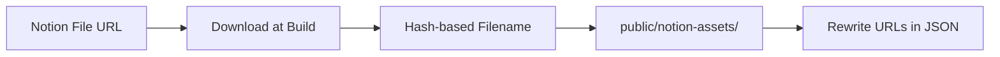

# 📚 Notion Backend Architecture

> **Scope**: This document defines the **Notion-as-CMS backend** for a portfolio site. It covers database schemas, relations, page-body conventions, build-time sync, deep-linking, and operational concerns.

---

## 📋 Table of Contents

1. [Goals & Principles](#-goals--principles)
2. [High-Level Architecture](#-high-level-architecture)
3. [Notion Integration Setup](#-notion-integration-setup)
4. [Core Data Model](#-core-data-model)
5. [Database Schemas](#-database-schemas)
   - [Organizations](#1-organizations)
   - [Involvements (Experiences)](#2-involvements-experiences)
   - [Projects](#3-projects)
   - [Skills](#4-skills)
6. [Page Body Conventions](#-page-body-conventions)
7. [Handling @Mentions & Rich Text](#-handling-mentions--rich-text)
8. [Icons, Covers & Assets](#-icons-covers--assets)
9. [Build-Time Sync Pipeline](#-build-time-sync-pipeline)
10. [Deep-Linking Strategy (Option B)](#-deep-linking-strategy-option-b)
11. [Push-Button Publishing](#-push-button-publishing)
12. [Schema Evolution](#-schema-evolution)
13. [Account & Workspace Changes](#-account--workspace-changes)
14. [Failure Modes & Mitigations](#-failure-modes--mitigations)
15. [Output Contract Summary](#-output-contract-summary)

---

## 🎯 Goals & Principles

| Principle | Description |
|-----------|-------------|
| **Static-first** | All content generated at build time → served from CDN (fast, reliable) |
| **Notion as authoring UI** | Edit in Notion; site consumes normalized export |
| **Stable site schema** | Site doesn't break when Notion property *names* change |
| **No runtime Notion calls** | Token never ships to browser; no live API calls from site |
| **Push-button publish** | Edit in Notion → trigger rebuild intentionally |
| **Single-page UX + deep links** | One scrollable page with panes; shareable URLs per entity |

---

## 🏗 High-Level Architecture


---

## 🔐 Notion Integration Setup

### Step 1: Create Internal Integration

1. Go to [notion.so/my-integrations](https://notion.so/my-integrations)
2. Click **"New integration"**
3. Configure:
   - **Name**: `portfolio-sync` (or similar)
   - **Capabilities**: ✅ Read content only (no write needed)
   - **User info**: None
4. Copy the **Internal Integration Token** (starts with `ntn_` or `secret_`)

### Step 2: Share Databases

> ⚠️ The integration can **only access** content explicitly shared with it.

For each of the 4 databases:
1. Open database in Notion
2. Click `...` → **Connections** → Add your integration
3. Confirm access

### Step 3: Collect Database IDs

Extract IDs from database URLs:
```
https://notion.so/workspace/abc123def456...?v=...
                          ^^^^^^^^^^^^^^^^
                          This is the database ID
```

### Step 4: Environment Variables

Store in your deploy environment (never commit to git):

| Variable | Description |
|----------|-------------|
| `NOTION_TOKEN` | Integration token |
| `NOTION_DB_ORGANIZATIONS_ID` | Organizations database ID |
| `NOTION_DB_INVOLVEMENTS_ID` | Involvements database ID |
| `NOTION_DB_PROJECTS_ID` | Projects database ID |
| `NOTION_DB_SKILLS_ID` | Skills database ID |

**Optional** (if using webhooks):
| Variable | Description |
|----------|-------------|
| `NOTION_WEBHOOK_SECRET` | Webhook signing secret |
| `REBUILD_HOOK_URL` | Your hosting provider's deploy hook |

---

## 🗂 Core Data Model

### Entity Relationships


### Relation Resolution Pattern

Notion relations return **page IDs only**, not full objects:

```json
{
  "Projects": {
    "relation": [
      { "id": "abc-123" },
      { "id": "def-456" }
    ]
  }
}
```

**Sync responsibility**: Build maps (`projectsById`, `skillsById`, etc.) and resolve IDs → full objects at build time.

---

## 📊 Database Schemas

### Universal Properties (add to all 4 databases)

| Property | Type | Purpose | Required |
|----------|------|---------|----------|
| `Slug` | Text | Stable URL identifier | ✅ Yes |
| `Published` | Checkbox | Include on site? | ✅ Yes |
| `Sort Order` | Number | Manual ordering override | Optional |

> 💡 **Why Slug?** Notion page IDs can change on duplicate/migrate. Slugs keep URLs stable across migrations.

---

### 1. Organizations

#### Site Purpose
Show **organization context** + tenure arc:
- **Single involvement** → Show org context, then involvement content inline
- **Multiple involvements** → Show org context + timeline of involvements

#### Properties

| Property | Type | Site Usage | Notes |
|----------|------|------------|-------|
| **Name** | Title | Display | ✅ Required |
| **Slug** | Text | URL: `/orgs/<slug>` | ✅ Required |
| **Published** | Checkbox | Filter | ✅ Required |
| **Type** | Select | Badge (e.g., "Company", "School") | Optional |
| **Logo** | Files | Org branding | Optional |
| **URL** | URL | External link | Optional |
| **Location** | Text | Display | Optional |
| **Involvements** | Relation → Involvements | Resolve for timeline | Auto-populated |
| **Email** | Email | ❌ Ignore | Private |
| **Life Area** | Relation | ❌ Ignore | Private |
| **Months/Time With** | Formula/Rollup | ❌ Ignore | Derive from dates |

#### Page Body
Entire body = **"Org Context"** (no special headings required)

---

### 2. Involvements (Experiences)

#### Site Purpose
Consistent layout per involvement:

| Section | Source |
|---------|--------|
| 1️⃣ **TLDR** | Page body (under `## TLDR` heading) |
| 2️⃣ **Role Overview** | Page body (under `## Role Overview` heading) |
| 3️⃣ **Portfolio & Impact** | Projects relation → custom carousel |
| 4️⃣ **Skills Cultivated** | Skills relation → badge grid |

#### Properties

| Property | Type | Site Usage | Notes |
|----------|------|------------|-------|
| **Title** | Title | Role name display | ✅ Required |
| **Slug** | Text | URL: `/involvements/<slug>` | ✅ Required |
| **Published** | Checkbox | Filter | ✅ Required |
| **Organization** | Relation → Organizations | Resolve for context | ✅ Required |
| **Dates** | Date range | Display + duration calc | ✅ Required |
| **Current** | Checkbox | "Present" indicator | Optional |
| **Type** | Select | Badge (e.g., "Full-time") | Optional |
| **Location** | Select/Text | Display | Optional |
| **Projects** | Relation → Projects | Carousel source | Optional |
| **Skills Developed** | Relation → Skills | Badge source | Optional |
| **Compensation** | Various | ❌ Ignore | Private |
| **Supervisor(s)** | Relation | ❌ Ignore | Private |
| **Life Area(s)** | Relation | ❌ Ignore | Private |
| **Duration/Months** | Formula | ❌ Ignore | Derive from Dates |

#### Page Body Structure

```markdown
## TLDR
- Built X that achieved Y
- Led team of Z to deliver...
- Used @Unity and @Swift to...

## Role Overview
Context about the role, team, and organization...
More details about responsibilities...
```

> ⚠️ **Headings are required**: `## TLDR` and `## Role Overview` must exist for section extraction.

---

### 3. Projects

#### Site Purpose
Project detail pane structure:

| Section | Source |
|---------|--------|
| 1️⃣ **Worked on as part of** | Involvements relation → rich links |
| 2️⃣ **Project Overview** | Page body (under `## Project Overview`) |
| 3️⃣ **Under the Hood** | Page body (under `## Under the Hood`) |
| 4️⃣ **Impact + Achievements** | Page body (under `## Impact + Achievements`) |
| 5️⃣ **Skills Used** | Skills relation → badge links |

#### Properties

| Property | Type | Site Usage | Notes |
|----------|------|------------|-------|
| **Name** | Title | Display | ✅ Required |
| **Slug** | Text | URL: `/projects/<slug>` | ✅ Required |
| **Published** | Checkbox | Filter | ✅ Required |
| **Dates** | Date range | Display | Optional |
| **Involvements** | Relation → Involvements | "Worked on as part of" | Optional |
| **Involved With** | Relation → Organizations | Context | Optional |
| **Skills Developed** | Relation → Skills | Badge links | Optional |
| **Tags** | Multi-select | Categorization | Optional |
| **Links** | URL | Demo/GitHub links | Optional |
| **Cover** | Files | Hero image (or use page cover) | Optional |
| **Year** | Select/Number | Display | Optional |
| **Duration/Months** | Formula | ❌ Ignore | Derive from Dates |

#### Page Body Structure

```markdown
## Project Overview
Why this project exists, the problem it solves...

## Under the Hood
Technical architecture, key decisions, complexity...
Used @React and @TypeScript for the frontend...

## Impact + Achievements
- 50% improvement in X
- Used by Y users
- Won Z award
```

> ⚠️ **Headings are required**: All three section headings must exist.

---

### 4. Skills

#### Site Purpose
**No standalone page** — Skills appear as:
- Inline mention chips (e.g., "Used @Unity")
- Badge grids on involvement/project pages
- **Modal/popover** on click/hover with:
  - Skill context (from page body)
  - Properties (proficiency, related items)

#### Properties

| Property | Type | Site Usage | Notes |
|----------|------|------------|-------|
| **Name** | Title | Display | ✅ Required |
| **Slug** | Text | Internal linking | ✅ Required |
| **Published** | Checkbox | Filter | ✅ Required |
| **Type** | Select | Grouping (e.g., "Language", "Framework") | Optional |
| **Icon** | Files or page icon | Visual | Optional |
| **Proficiency (1-5)** | Number | Display in modal | Optional |
| **Related Projects** | Relation → Projects | Modal links | Optional |
| **Related Involvements** | Relation → Involvements | Modal links | Optional |
| **Experience/Months** | Rollup/Formula | ❌ Ignore | Derive if needed |

#### Page Body
Entire body = **"Skill Context"** (brief description for modal)

Example:
```markdown
Unity is a cross-platform game engine commonly used for VR/AR development, 
mobile games, and interactive experiences. It uses C# as its primary 
scripting language.
```

---

## 📝 Page Body Conventions

### Section Extraction Rules

The sync script extracts sections by **heading markers**:

```
Everything under ## HEADING until the next same-or-higher level heading
= that section's content
```

### Required vs Optional Headings

| Entity | Required Headings | Optional/Ignored |
|--------|-------------------|------------------|
| **Organization** | None (all body = context) | — |
| **Involvement** | `## TLDR`, `## Role Overview` | `## Notes`, `## Links` |
| **Project** | `## Project Overview`, `## Under the Hood`, `## Impact + Achievements` | — |
| **Skill** | None (all body = context) | — |

### Missing Heading Behavior

Configure sync script mode:
- **Strict mode** (recommended): Build fails with clear error
- **Lenient mode**: Treat entire body as fallback section

---

## 🔗 Handling @Mentions & Rich Text

### What Notion Returns

When you type `@Unity` in Notion, the API returns:

```json
{
  "type": "mention",
  "mention": {
    "type": "page",
    "page": { "id": "abc-123-def" }
  },
  "plain_text": "Unity"
}
```

### Normalization Strategy

The sync script transforms mentions into frontend-agnostic tokens:

```json
{
  "type": "mention",
  "entityType": "skill",
  "id": "abc-123-def",
  "slug": "unity",
  "label": "Unity"
}
```

### Resolution Requirements

1. Build a map: `notionPageId → { entityType, slug, title }`
2. During block parsing, resolve `mention.page.id` against this map
3. If ID not found (unpublished or wrong DB), render as plain text

### Frontend Rendering Options

| Entity Type | Suggested Rendering |
|-------------|---------------------|
| **Skill** | Inline pill/chip with icon |
| **Project** | Styled link (opens project pane) |
| **Involvement** | Styled link (opens involvement pane) |
| **Organization** | Styled link (opens org pane) |

---

## 🖼 Icons, Covers & Assets

### What's Available

| Asset | Location | Type |
|-------|----------|------|
| **Page Icon** | Page object `.icon` | Emoji or Image |
| **Page Cover** | Page object `.cover` | Image |
| **Inline Images** | Block content | Image blocks |
| **File Properties** | Database properties | Files type |

### ⚠️ Critical: Notion URLs Expire

Notion-hosted file URLs are **signed and expire** (~1 hour).

**You MUST download assets at build time.**

### Asset Pipeline



### Implementation

1. During sync, detect all image/file URLs
2. Download to `public/notion-assets/<hash>.<ext>`
3. Rewrite references in normalized content to `/notion-assets/<hash>.<ext>`
4. Result: Images served from your CDN, never expire

---

## ⚙️ Build-Time Sync Pipeline

### Inputs

| Input | Source |
|-------|--------|
| `NOTION_TOKEN` | Environment variable |
| Database IDs | Environment variables |
| `Notion-Version` | Pinned header (≥ `2025-09-03`) |

### Outputs

```
src/content/cache/
├── organizations.json
├── involvements.json
├── projects.json
├── skills.json
└── meta.json          # Build timestamp, schema version

public/notion-assets/
├── abc123.png
├── def456.webp
└── ...
```

### Sync Steps


### Detailed Steps

| Step | Description | API Calls |
|------|-------------|-----------|
| **1. Fetch schemas** | `databases.retrieve` for each DB | 4 |
| **2. Validate** | Check required props exist with correct types | 0 |
| **3. Query DBs** | `databases.query` with `Published = true` filter | 4 (paginated) |
| **4. Normalize** | Convert Notion format → canonical objects | 0 |
| **5. Build maps** | Create `byId` lookup maps | 0 |
| **6. Resolve relations** | Replace ID arrays with resolved objects | 0 |
| **7. Fetch blocks** | `blocks.children.list` for each page | N pages |
| **8. Extract sections** | Parse heading structure | 0 |
| **9. Resolve mentions** | Look up mention IDs in maps | 0 |
| **10. Download assets** | HTTP fetch for each image/file | M assets |
| **11. Emit JSON** | Write normalized output files | 0 |

### Rate Limit Handling

Notion limits: **~3 req/sec average**

- Implement exponential backoff on 429 responses
- Batch requests where possible
- Typical portfolio (50-100 pages) syncs in 30-60 seconds

---

## 🔗 Deep-Linking Strategy (Option B)

### The UX Goal

> Single-page app feel (panes open/close, no navigation) **+** shareable URLs per entity

### Implementation: Entry Routes

Generate static HTML at these paths:

| Route Pattern | Opens |
|---------------|-------|
| `/` | Homepage (no pane open) |
| `/orgs/<slug>` | Homepage + Organization pane |
| `/involvements/<slug>` | Homepage + Involvement pane |
| `/projects/<slug>` | Homepage + Project pane |

### How It Works

1. **All routes serve the same shell** (your single-page app)
2. **Route includes "initial pane" data** (entity type + slug)
3. **On load**, app checks route and auto-opens the correct pane
4. **User closes pane** → URL updates to `/` (via History API)
5. **User opens different entity** → URL updates accordingly

### Benefits

| Benefit | Why It Matters |
|---------|----------------|
| ✅ **Shareable URLs** | Recruiter can send `/projects/meet-the-artist` to hiring manager |
| ✅ **Per-entity OG tags** | Social previews show project title, cover, description |
| ✅ **SEO-friendly** | Each entity is crawlable |
| ✅ **Static** | Still pure CDN, no server runtime |
| ✅ **Fast** | Same performance as homepage |

### Slug Requirements

| Requirement | Rationale |
|-------------|-----------|
| **Unique within entity type** | `/projects/foo` and `/involvements/foo` can coexist |
| **URL-safe** | Lowercase, hyphens, no special chars |
| **Stable** | Don't change slugs after publishing |
| **Human-readable** | `meet-the-artist` > `abc123` |

### Build Output

The sync script should output a `sharePath` for each entity:

```json
{
  "slug": "meet-the-artist",
  "sharePath": "/projects/meet-the-artist",
  "...": "..."
}
```

---

## 🚀 Push-Button Publishing

### Workflow Goal

```
Edit in Notion → Press button → Site updates in ~2 minutes
```

### Option A: Manual Deploy Hook (Simplest)

1. Create deploy hook in hosting dashboard
2. Bookmark the URL or create a Notion page with link
3. Click when ready to publish

**Pros**: Zero infrastructure  
**Cons**: Not "inside Notion"

### Option B: Notion Button + Webhook (Best UX)


**Setup**:
1. Create a `Site Ops` database with one row: "Portfolio Site"
2. Add a **Button** property: "Rebuild Site" that sets `RebuildRequestedAt = now()`
3. Register Notion webhook → your handler endpoint
4. Handler verifies + triggers hosting deploy hook

### Option C: Auto-Rebuild on Content Change

- Webhook triggers rebuild on any `page.content_updated` in your DBs
- **Caution**: May rebuild frequently while mid-edit

### Recommended Approach

Start with **Option A** (manual). Upgrade to **Option B** when the manual step feels tedious.

---

## 🔄 Schema Evolution

### The Problem

> "I renamed a Notion property and my site broke"

### The Solution: Map by Property ID, Not Name

Notion property **names** are user-editable. Property **IDs** are stable.

### Implementation

#### 1. Schema Lock File

On first sync, capture and commit:

```json
// notion.schema-lock.json
{
  "involvements": {
    "title": { "id": "title", "type": "title" },
    "slug": { "id": "abc123", "type": "rich_text" },
    "organization": { "id": "def456", "type": "relation" }
  }
}
```

#### 2. Mapping Config

```typescript
// src/lib/notion/field-map.ts
export const FIELD_MAP = {
  involvements: {
    title: 'title',           // property ID (or 'title' for title prop)
    slug: 'abc123',           // property ID from schema lock
    organization: 'def456',
    // ...
  }
} as const;
```

#### 3. Validation on Build

| Scenario | Behavior |
|----------|----------|
| **Required field missing** | ❌ Fail with: `"Missing required: involvements.slug"` |
| **Required field wrong type** | ❌ Fail with: `"Type mismatch: involvements.slug expected text, got number"` |
| **Optional field missing** | ✅ Omit gracefully |
| **New field added** | ✅ Ignore until mapped |
| **Field renamed** | ✅ No impact (mapped by ID) |

### Derived Fields Recommendation

Avoid depending on Notion **formulas/rollups** as source-of-truth:

| Instead of | Use |
|------------|-----|
| `Duration` formula | Compute from `Dates` in sync script |
| `Months` rollup | Compute from `Dates` in sync script |
| `Skills From Projects` rollup | Resolve from Project.Skills relation |

---

## 👤 Account & Workspace Changes

### Scenario Matrix

| Scenario | Impact | Action Required |
|----------|--------|-----------------|
| **Email change** (same workspace) | ✅ None | Nothing |
| **Transfer workspace ownership** | ⚠️ Maybe | Re-share DBs if you lose access |
| **Migrate to new workspace** | 🔄 Full reset | New token, new DB IDs, re-share all |
| **Token revoked** | ❌ Builds fail | Regenerate token, update secret |

### Migration Checklist (New Workspace)

- [ ] Create new integration in new workspace
- [ ] Copy new token → update `NOTION_TOKEN` secret
- [ ] Get new database IDs → update env vars
- [ ] Share all 4 databases with new integration
- [ ] Update `notion.schema-lock.json` with new property IDs
- [ ] Verify slugs are preserved (URLs stay stable)

---

## 🚨 Failure Modes & Mitigations

| Error | Cause | Fix |
|-------|-------|-----|
| `401 Unauthorized` | Token revoked/invalid | Regenerate token |
| `404 Not Found` | DB/page not shared with integration | Re-share in Notion |
| `429 Rate Limited` | Too many requests | Implement backoff; batch requests |
| `Broken images` | Used expiring Notion URLs | Download assets at build time |
| `Missing headings` | Template not followed | Use strict mode; add missing headings |
| `Relation to unpublished` | Related item has `Published = false` | Filter by Published before emitting |
| `Schema validation fail` | Required property missing/changed | Check Notion DB; update schema lock |

---

## 📦 Output Contract Summary

### Entity Shape (Frontend-Agnostic)

```typescript
interface Organization {
  id: string;              // Notion page ID (internal)
  slug: string;            // URL identifier
  sharePath: string;       // e.g., "/orgs/university-of-southern-california"
  name: string;
  published: boolean;
  type?: string;           // "Company" | "School" | etc.
  logo?: string;           // Local asset path
  url?: string;
  location?: string;
  involvements: ResolvedRef[];  // Resolved involvement refs
  context: BlockNode[];         // Page body blocks
  icon?: Icon;
  cover?: string;          // Local asset path
}

interface Involvement {
  id: string;
  slug: string;
  sharePath: string;       // e.g., "/involvements/founder-president"
  title: string;
  published: boolean;
  organization: ResolvedRef;
  dates: { start: string; end?: string };
  current: boolean;
  type?: string;
  location?: string;
  projects: ResolvedRef[];
  skills: ResolvedRef[];
  sections: {
    tldr: BlockNode[];
    roleOverview: BlockNode[];
  };
  icon?: Icon;
  cover?: string;
}

interface Project {
  id: string;
  slug: string;
  sharePath: string;       // e.g., "/projects/meet-the-artist"
  name: string;
  published: boolean;
  dates?: { start: string; end?: string };
  involvements: ResolvedRef[];
  organizations: ResolvedRef[];
  skills: ResolvedRef[];
  tags: string[];
  links?: string[];
  sections: {
    overview: BlockNode[];
    underTheHood: BlockNode[];
    impact: BlockNode[];
  };
  icon?: Icon;
  cover?: string;
}

interface Skill {
  id: string;
  slug: string;
  name: string;
  published: boolean;
  type?: string;           // "Language" | "Framework" | etc.
  proficiency?: number;    // 1-5
  relatedProjects: ResolvedRef[];
  relatedInvolvements: ResolvedRef[];
  context: BlockNode[];    // Page body for modal
  icon?: Icon;
}

// Supporting types
interface ResolvedRef {
  id: string;
  slug: string;
  title: string;           // Display name
  sharePath: string;
}

interface Icon {
  type: 'emoji' | 'image';
  value: string;           // Emoji char or local asset path
}

interface BlockNode {
  type: string;            // 'paragraph' | 'heading_1' | 'code' | etc.
  content: InlineToken[];  // For text blocks
  children?: BlockNode[];  // For nested blocks
  // Block-specific props (language for code, url for image, etc.)
}

interface InlineToken {
  type: 'text' | 'mention' | 'link' | 'code';
  text?: string;
  // For mentions:
  entityType?: 'skill' | 'project' | 'involvement' | 'organization';
  slug?: string;
  label?: string;
  // For links:
  url?: string;
}
```

### File Structure

```
src/content/cache/
├── organizations.json    # Organization[]
├── involvements.json     # Involvement[]
├── projects.json         # Project[]
├── skills.json           # Skill[]
└── meta.json             # { buildTime, schemaVersion }

public/notion-assets/
├── <hash>.png
├── <hash>.webp
└── ...

notion.schema-lock.json   # Committed; property ID mappings
```

---

## ✅ Implementation Checklist

### Notion Setup
- [ ] Create internal integration
- [ ] Share all 4 databases with integration
- [ ] Add `Slug` and `Published` properties to all DBs
- [ ] Add required headings to Involvement/Project templates
- [ ] Store token + DB IDs in hosting secrets

### Sync Script
- [ ] Implement schema fetch + validation
- [ ] Implement paginated DB queries
- [ ] Implement property normalization
- [ ] Implement relation resolution
- [ ] Implement block fetching + section extraction
- [ ] Implement mention resolution
- [ ] Implement asset downloading
- [ ] Implement JSON output
- [ ] Add rate limit handling (backoff)
- [ ] Add strict/lenient mode config

### Deploy Pipeline
- [ ] Set up hosting with env vars
- [ ] Create deploy hook URL
- [ ] Test manual trigger
- [ ] (Optional) Set up webhook automation

---

*Last updated: December 2025*

